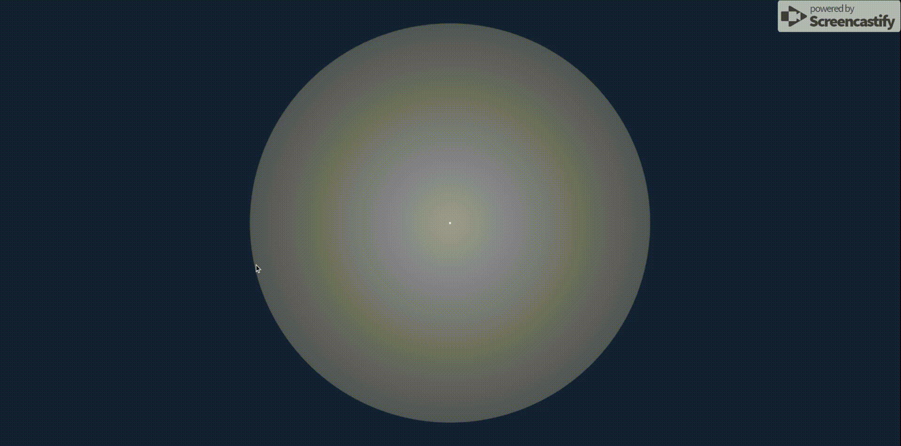
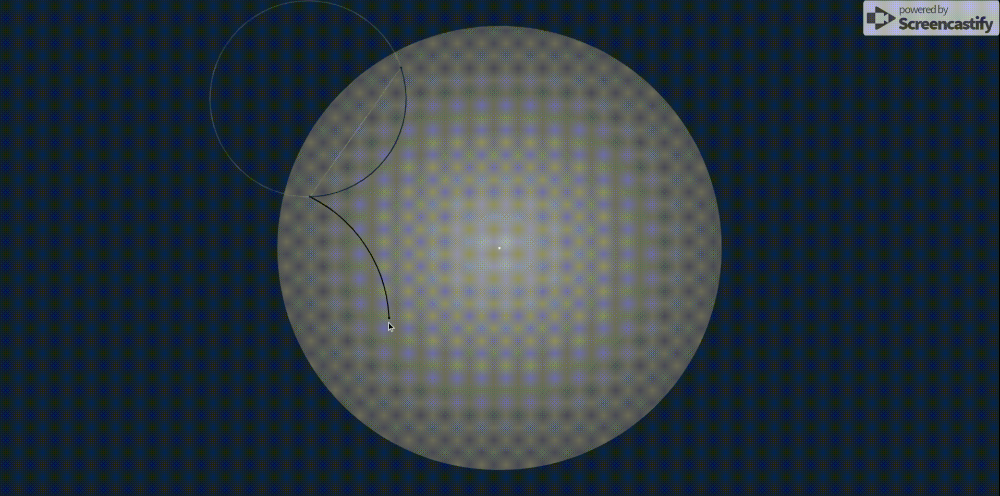
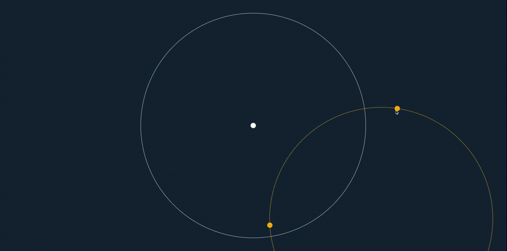

# Projekcja Poincaré na przestrzeni 2D

Geometrię hiperboliczną otrzymuje się z geometrii euklidesowej w wyniku zastąpienia pewnika o prostych równoległych następującym postulatem hiperbolicznym:

> „Przez dowolny punkt nieleżący na danej prostej przechodzą co najmniej dwie różne proste niemające wspólnych punktów z tą prostą”.

`https://pl.wikipedia.org/wiki/Geometria_hiperboliczna`

Narysujmy koło na płaszczyźnie euklidesowej. Wnętrze tego koła (ale nie samo koło) reprezentuje płaszczyznę hiperboliczną. Nie ma więc krawędzi, możemy iść bez końca coraz bliżej kręgu, ale nigdy go nie osiągać.

1. Punkty we wnętrzu koła są „punktami” w płaszczyźnie hiperbolicznej.

2. „Linie” w płaszczyźnie hiperbolicznej to albo euklidesowe średnice koła (linie przechodzące przez środek) minus ich punkty końcowe, albo koła euklidesowe, które przecinają główny okrąg pod kątem prostym.

3. W modelu kąty są zachowane, więc jeśli zmierzymy kąt za pomocą kątomierza, będzie on taki sam jak kąt hiperboliczny. Inaczej jest z długością. W miarę zbliżania się do krawędzi odległość euklidesowa maleje w porównaniu do odległości hiperbolicznej.

