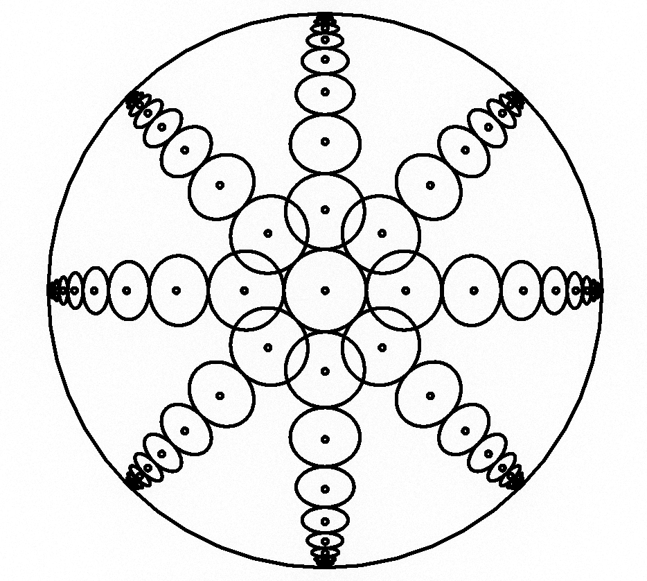
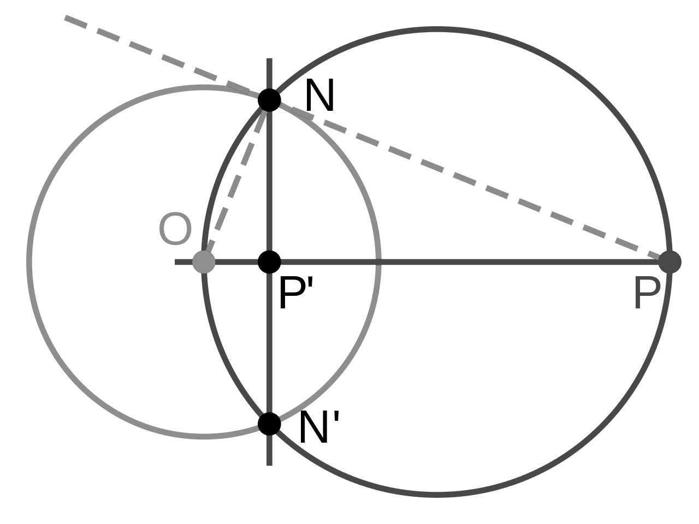
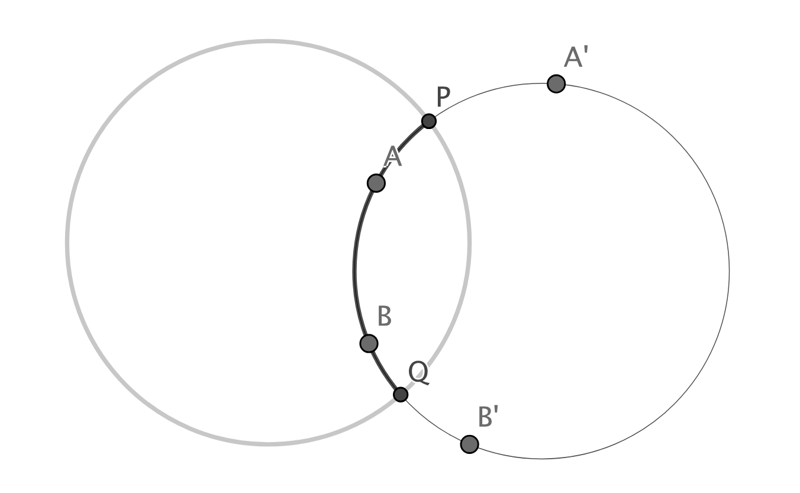
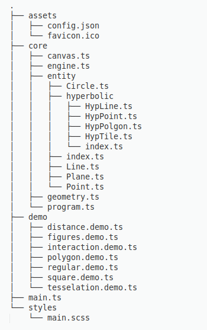
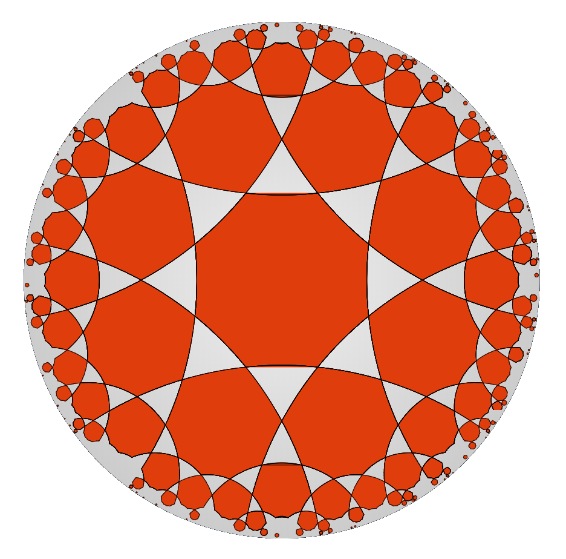

\newtheorem{theorem}{Twierdzenie}
<!-- -------------------------------- -->

\tableofcontents

\newpage\null\newpage

# Wstęp

## Wprowadzenie

__Celem pracy jest zaprogramowanie i implementacja silnika graficznego służącego do generowania podstawowych obiektów geometrycznych w geometrii hiperbolicznej. Weybrano jej model - tak zwany dysk Poincaré. Biblioteka została napisana w języku `Typescript` (który jest wersją języka `JavaScript` zawierającą ponadto silne typowianie).__
\vspace{3mm}

Praca swoim zakresem obejmie obsługę rysowania lini, okręgów, wielokątów na tejże płaszczyźnie oraz implementacje przykładowych programów obejmujących wizualizacje bardziej skomplikowanych struktur. Na tle innych implementacji, aplikacja wyróżnia się dostarczanymi możliwościami i realizacją problemu z pomocą matematycznego opisu pewnego modelu. Przykładowe demonstracje możliwości aplikacji są dostarczone razem z kodem źródłowym, jest to, poza możliwością narysowania dowolnego wielokąta, rysowaniem figur foremnych czy prostych animacji, także interakcja z urządzeniami peryferyjnymi i tesselacja przestrzeni hiperbolicznej. Niewątpliwą zaletą dostarczonej aplikacji jest prostota implementacji własnych rozwiązań, na co składa się silne typowanie języka Typescript wraz z dokładnymi interfejsami dla klas oraz funkcje dostarczone przez silnik, pozwalające na łatwe manipulowanie wyświetlającymi się obiektami, nie wymagające przy tym zrozumienia modelu.

\vspace{3mm}
__Praca składa się z czterech rozdziałów:__

\vspace{3mm}
__Rozdział pierwszy__: Omówienie analizy wybranego problemu, przedstawienie motywacji podjęcia tego tematu oraz uzasadnionienie wybór modelu płaszczyzny Poincaré. Rozdział zawiera poza tym komentarz do różnych rodzajów geometrii nieeuklidesowych, oraz krótki opis i porównanie innych modeli geometrii hiperbolicznej.

\vspace{3mm}
__Rozdział drugi__: Szczegółowa charakterystyka systemu wraz z opisem poszczególnych plików oraz przeznaczeniem klas i funkcji składających się na program. Opisanie algorytmów przekształcających byty w geometrii euklidesowej na odpowiadające im elementy geometrii hiperbolicznej, funkcji pomocniczych, reprezentacji punktów i linii w obu modelach.

\vspace{3mm}
__Rozdział trzeci__: Opis technologii użytych do implementacji projektu: wybranego języka programowania, środowiska składającego się na aplikację oraz bibliotek wykorzystanych w programie.

\vspace{3mm}
__Rozdział czwarty__: Instrukcje instalacji i wdrożenia systemu w środowisku docelowym. Końcowy rozdział stanowi podsumowanie uzyskanych wyników i ewentualne możliwości rozwoju projektu.

\vspace{3mm}
Udało się zrealizować wszystkie postawione cele.

## Kontekst historyczny

__Geometria jest nauką o mierze. Nazwa ta narzuca silne skojarzenia z nauką niemalże przyrodniczą. Nauczana we wszystkich szkołach od dwóch i pół tysiaca lat - wydawałoby się jest już czymś bardzo dobrze poznanym. Nowe teorie matematyczne doprowadziły jednak do podważenia tej pewności i powstania geometrii alternatywnych.__

\vspace{3mm}

O życiu Euklidesa wiemy bardzo niewiele, a przecież to jemu zawdzięczamy nazwę _naszej_ geometrii. Ani data urodzenia, ani pochodzenie nie są nam znane, a wszystkie informacje o nim czerpiemy z antycznych dzieł w których opisana jest matematyka. Około 300 roku przed naszą erą, Euklides - dyrektor Biblioteki Aleksandryjskiej, wydał swoje największe dzieło - _Elementy Geometrii_, na które składa się 13 ksiąg zawierających właściwie całą wiedzę matematyczną tamtych czasów. Początkowe definicje pierwszej księgi posiadają 5 stwierdzeń, które według Euklidesa są tak proste, że nie wymagają uzasadnienia. Euklides nazwał je aksjomatami:

> 1. Od dowolnego punktu do dowolnego innego można poprowadzić prostą.
> 2. Ograniczoną prostą można dowolnie przedłużyć.
> 3. Z dowolnego środka dowolnym promieniem można opisać okrąg.
> 4. Wszystkie kąty proste są równe (przystające).
> 5. Jeśli 2 proste na płaszczyźnie tworzą z trzecią kąty jednostronne wewnętrzne o sumie mniejszej od 2 kątów prostych, to proste te, po przedłużeniu, przetną się i to z tej właśnie strony. [^axioms]

Piąty aksjomat mówi o tym, że z jednej strony przecinanej linii dwie proste będą się przybliżać. Zaczął on dość szybko wzbudzać podejrzenia. Jest znacznie bardziej skomplikowany od pozostałych, a już na pewno nie tak intuicyjny. Nawet Euklides unikał używania go w swoim dziele tak długo, jak to było możliwe i użył go dopiero w dowodzie własności 29.

Można śmiało powiedzieć, że piąty aksjomat w kolejnych wiekach spędzał uczonym sen z powiek. Przez kolejne 1500 lat matematycy próbowali udowodnić, że o wiele bardziej skomplikowany postulat musi wynikać z pozostałych czterech. Jednym z pierwszych zajmujących się tym problemem uczonych, był żyjący w V wieku naszej ery Proklos. Stwierdził on w swoim komentarzu do dzieł Euklidesa:

> Nie jest możliwe, aby uczony tej miary co Euklides godził się na obecność tak długiego postulatu w aksjomatyce – obecność postulatu wzięła się z pospiesznego kończenia przez niego Elementów, tak aby zdążyć przed nadejściem słusznie oczekiwanej rychłej śmierci; my zatem – czcząc jego pamięć – powinniśmy ten postulat usunąć lub co najmniej znacznie uprościć. [^proklos_annotation]

Wyzwanie usunięcia piątego aksjomatu podjęło wielu matematyków w kolejnych wiekach. Prowadziło to do postania wielu nowych twierdzeń, które w istocie były piątemu aksjomatowi równoważne. Prowadziło to do sprzeciwu innych uczonych. W szczególności Immanuel Kant w swoim dziele _Krytyka czystego rozumu_ stwierdził, że intuicja geometryczna jest wrodzona, więc nie może istnieć wiele równoległych geometrii, a każdy kto chciałby zajmować się alternatywnymi geometriami nie nadaje się do nauki. Nie wszyscy zgodzili się z tym stwierdzeniem. Udano się do największego w tamtym czasie autorytetu - Carla Friedricha Gaussa, który jednak wycofał się, bojąc się - jak pisał - wrzasku Beotów. Do problemu należało się jednak odnieść. Odważyło się na to dwóch młodych ludzi, którzy uparli się nie tylko na uprawianie tej geometrii, ale wręcz głosili jej równoprawność. Rosjanin,  Nikołaj Łobaczewski oraz Węgier - Janos Bolyai, niezależnie od siebie opublikowali prace w których - chociaż odmiennie - nowa geometria była konsekwentnie wyprowadzona. Obu odkrywców spotkała też za to kara, Łobaczewski został wręcz zmuszony do opuszczenia katedry.

\vspace{3mm}
Sprawę nowej geometrii (nazywanej już geometrią Bolyaia-Łobaczewskiego) przejął Felix Klein. Postawił on tezę, że jeżeli za pomocą geometrii euklidesowej jesteśmy w stanie przedstawić tę nieeuklidesową - i odwrotnie, to oba modele są sobie w istocie równoważne. Opublikował też w 1870 roku dzieło, w którym dowiódł równoprawności obu modeli.

Dosadnie do nowego modelu odniósł się fizyk - Hermann Helmholtz, publikując pracę, w której określił matematykę jako skrzynkę z narzędziami dla nauk przyrodniczych, czym odebrał jej walor nauki przyrodniczej jako takiej.

[^axioms]: [Geometria euklidesowa. Encyklopedia PWN](https://encyklopedia.pwn.pl/haslo/geometria-euklidesowa;3904959.html)
[^proklos_annotation]: [Najgłupiej postawiony problem matematyki. Marek Kordos - Delta, maj 2012](http://www.deltami.edu.pl/temat/matematyka/geometria/planimetria/2012/04/25/Dowody_V_postulatu_Euklidesa/)

\newpage\null\newpage

# Analiza problemu

__W tym rozdziale przedstawiona będzie analiza problemu, opis matematyczny modelu płaszczyzny dysku Poincaré oraz przegląd kilku wybranych modeli geometrii nieeuklidesowej.__

\vspace{3mm}
Odkrycie, że piątego aksjomatu nie można udowodnić na podstawie pozostałych czterech aksjomatów, było dla naukowców niespodzianką. Zrobiono to, demonstrując istnienie geometrii, w której pierwsze cztery aksjomaty utrzymywały się, ale piąty nie. Debata nad piątym postulatem Euklidesa stworzyła problem, jak powinna wyglądać alternatywna geometria. Umiano pokazać zaledwie poszczególne właściwości takich geometrii. Pierwszy model geometrii nieeuklidesowej został stworzony przez Kleina. W sprawę zaangażowało się wielu matematyków, w tym również Bernard Rieman. Stwierdził on, że można opisać nieskończenie wiele struktur matematycznych, które nie będą spełniały postulatów Euklidesa, będąc dalej geometriami.

## Podstawowy podział

Geometria nieeuklidesowa to każda geometria, która nie spełnia przynajmniej jednego z postulatów Euklidesa. Geometrie nieeuklidesowe możemy podzielić na dwa rodzaje:

{ width=250px }

### Geometria Łobaczewskiego-Bolyaia (hiperboliczna)

  Geometria hiperboliczna jest bliżej związana z geometrią euklidesową, niż się wydaje. Jedyną różnicą aksjomatyczną jest postulat równoległy. Po usunięciu postulatu równoległego z geometrii euklidesowej geometria wynikowa jest geometrią absolutną. Wszystkie twierdzenia o geometrii absolutnej, w tym pierwsze 28 twierdzeń zaprezentowanych przez Euklidesa, obowiązują w geometrii zarówno euklidesowej jak i hiperbolicznej.

  \vspace{3mm}
  W modelu hiperbolicznym, w płaszczyźnie dwuwymiarowej, dla dowolnej linii $L$ i punktu $X$, który nie jest na $L$, istnieje nieskończenie wiele linii przechodzących przez $X$, które nie przecinają $L$.

### Geometria Riemanna (eliptyczna)

  Geometria eliptyczna jest geometrią nieeuklidesową o dodatniej krzywiźnie, która zastępuje postulat równoległy stwierdzeniem "przez dowolny punkt na płaszczyźnie, nie ma linii równoległych do danej linii". Geometria eliptyczna jest czasem nazywana również geometrią Riemannowską. Model można wizualizować jako powierzchnię kuli, na której linie przyjmowane są jako wielkie koła. W geometrii eliptycznej suma kątów trójkąta wynosi więcej niż 180 stopni.
  
  \vspace{3mm}
  W modelu eliptycznym dla dowolnej linii $L$ i punktu $X$, który nie jest na $L$, wszystkie linie przechodzące przez $X$ przecinają $L$.

### Różnice pomiędzy geometriami

Sposobem opisania różnic między tymi geometriami jest rozważenie dwóch linii prostych rozciągniętych w nieskończoność w płaszczyźnie dwuwymiarowej, które są prostopadłe do trzeciej linii:

- W geometrii euklidesowej linie pozostają w stałej odległości od siebie (co oznacza, że linia narysowana prostopadle do jednej linii w dowolnym punkcie przecina drugą linię, a długość odcinka linii łączącego punkty przecięcia pozostaje stała) i są znane jako równoległe.
\vspace{3mm}

- W geometrii hiperbolicznej linie _zakrzywiają się_ od siebie, zwiększając odległość w miarę przesuwania się dalej od punktów przecięcia ze wspólną prostopadłą; linie te są często nazywane ultraparallelami.
\vspace{3mm}

- W geometrii eliptycznej linie _zakrzywiają się_ do siebie i w końcu przecinają.

\vspace{3mm}
Omawiane różnice pokazane są na poniższym rysunku.


Ta praca skupia się na geometrii hiperbolicznej.  
Istnieje kilka możliwych sposobów wykorzystania części przestrzeni euklidesowej jako modelu płaszczyzny hiperbolicznej. Wszystkie te modele spełniają ten sam zestaw aksjomatów i wyrażają tę samą abstrakcyjną płaszczyznę hiperboliczną. Dlatego wybór modelu nie ma znaczenia dla twierdzeń czysto hiperbolicznych, jednak różnica występuje podczas ich wizualizacji.  
Następne podrozdziały są poświęcone krótkiemu omówieniu najpopularniejszych z nich.

## Popularne modele geometrii hiperbolicznej

Geometria hiperboliczna została opisana za pomocą wielu modeli. Poniższej zaprezentowano cztery popularne modele.

### Model Kleina

Model Kleina - a w zasadzie model dysku Beltrami–Kleina jest modelem geometrii hiperbolicznej, w którym punkty są reprezentowane przez punkty we wnętrzu dysku. Przyjmuje on następujące założenia:

- __Płaszczyzną hiperboliczną__ jest wnętrze koła bez krawędzi.
\vspace{1mm}
- __Prostymi hiperbolicznymi__ są cięciwy tego koła (końce prostej).
\vspace{1mm}
- __Proste będą prostopadłe__ wtedy, gdy przedłużenie jednej z nich przechodzi przez punkt przecięcia stycznych do obu linii.

{ width=250px }

Linie w modelu pozostają proste, a cały model można łatwo osadzić w ramach rzeczywistej geometrii rzutowej. Model ten nie jest jednak zgodny, co oznacza, że kąty są zniekształcone, a okręgi na płaszczyźnie hiperbolicznej na ogół nie są okrągłe w modelu.

{ width=250px }

### Model półpłaszczyzny Poincaré

Model półpłaszczyzny Poincaré to model dwuwymiarowej geometrii hiperbolicznej, jest to płaszczyzna:
$$ {\{(x, y) \mid y > 0; x, y \in \mathbb {R} \}} $$

{ width=250px }

Model nosi imię Henri Poincaré, ale został stworzony przez Eugenio Beltrami, który użył go wraz z modelem Kleina i modelem dysku Poincaré, aby pokazać, że geometria hiperboliczna jest równie spójna, jak spójna jest geometria euklidesowa. Omawiany model jest zgodny, co oznacza, że kąty zmierzone w punkcie modelu są równe kątom na płaszczyźnie hiperbolicznej.

### Model dysku Poincaré

Model dysku Poincaré wykorzystuje wnętrze dysku jako model płaszczyzny hiperbolicznej.  
W poniższych przykładach omawiany będzie dysk jednostkowy, który będzie również przedmiotem dalszych rozważań.

- __Punkty hiperboliczne__ to punkty wewnątrz dysku jednostkowego.
\vspace{1mm}
- __Linie hiperboliczne__ to łuki koła prostopadłe do dysku. Linie hiperboliczne przechodzące przez początek degenerują się do średnic.
\vspace{1mm}
- __Kąty__ są mierzone jako kąt euklidesowy między stycznymi w punkcie przecięcia.
\vspace{1mm}
- __Odległości__ między punktami hiperbolicznymi można mierzyć w oparciu o wzór:[^distance]

$$ d_{H}(z_0, z_1) = ln(\frac{\left |1 - z_0 \overline{z_1}  \right | + \left |z_0 - z_1  \right |}{\left |1 - z_0 \overline{z_1}  \right | - \left |z_0 - z_1  \right |}) $$

[^distance]: [HyperbolicTransformations, Chapter 17, Equation 17.2.13](http://homepages.gac.edu/~hvidsten/geom-text/web-chapters/hyper-transf.pdf)

\vspace{3mm}
Ponieważ rozpatrywany jest dysk jednostkowy, powyższy wzór nie zawiera w zmiennej dla promienia.

{ width=250px }

Model jest zgodny, to znaczy, że zachowuje kąty. Oznacza to, że kąty hiperboliczne między krzywymi są równe kątom euklidesowym w punkcie przecięcia. Wadą jest, że linie hiperboliczne są modelowane poprzez łuki koła euklidesowego, przez co wydają się zakrzywione.

{ width=250px }

### Model Hemisfery

Hemisfera nie jest często używana jako model płaszczyzny hiperbolicznej. Jest jednak bardzo przydatna w łączeniu różnych innych modeli za pomocą różnych rzutów, jak pokazano na poniższym rysunku.

- __Punkty hiperboliczne__ to punkty na półkuli południowej.
\vspace{1mm}
- __Linie hiperboliczne__ to półkola powstałe z przecięcia półkuli południowej z płaszczyznami prostopadłymi do równika.

\begin{figure}[H]
\includegraphics[width=250px]{figures/hemisphere.png}
\centering
\caption{Rzut na dysk Poincaré (a) i projekcja do modelu Klein-Beltrami (b) [Martin Freiherr von Gagern, Creation of Hyperbolic Ornaments]}
\end{figure}

Wadą omawianego rozwiązania, jest dodatkowy wymiar, jaki należy rozpatrzeć podczas implementacji, co komplikuje pracę z tym modelem.

## Uzasadnienie wyboru modelu dysku Poincaré

Jak zaznaczono na wstępie, kolejne rozdziały, a także opisane implementacje będą prawie wyłącznie korzystać z modelu dysku Poincaré. Wydaje się to być właściwym wyborem, z uwagi na wartości estetyczne i wspomnianą zgodność tego modelu.


\newpage\null\newpage

# Projekt systemu

__W tym rozdziale przedstawiony zostanie szczegółowy projekt systemu, jego matematyczna interpretacja, zależności pomiędzy klasami oraz podstawowe algorytmy składające się na logikę funkcjonowania silnika.__

## Cykl pracy silnika

Głównym plikiem silnika jest `main.ts` znajdujący się w katalogu `/src`. Po uruchomieniu programu, tworzy on instancje klasy `Canvas` odpowiedzialnej za rysowanie elementów na ekranie, ładuje konfiguracje wyświetlanego programu i tworzy pętlę silnika poprzez wywołanie metody `createLoop()` klasy `Engine`.

\vspace{3mm}

Moduł odpowiedzialny za renderowanie obrazu znajduje się w pliku `canvas.ts`. Konstruktor klasy `Canvas` przyjmuje element `canvas` ze strony `index.html` oraz jego kontekst. Następie inicjuje się poprzez wywołanie funkcji `setupCanvas()`, która ustala szerokość i wysokość elementu. W każdym cyklu silnika, wywoływana jest funkcja `drawOverlay()`, która resetuje element do podstawowego widoku. Kolejne funkcje klasy odpowiadają za rysowanie punktów, linii, łuków i wielokątów. Poza tym klasa udostępnia też funcje zmiany koloru rysowanych elementów i grubości linii.

{ width=200px }


Klasa `Engine` przyjmuje konfigurację z pliku `/assets/config.json`, która ustala ilość FPS. Jednocześnie wywołuje metodę `drawOverlay()` klasy `Canvas` i uruchamia funkcję `onLoop()` z programu. Konfiguracja programu dostarczona jest z pomocą wzorca _dependency injection_ w parametrach konstruktora.

{ width=200px }

Odtwarzany program tworzony jest poprzez wywołanie instancji klasy, dziedziczącej po abstrakcyjnej klasie `Program`, która udostępnia metody takie jak `onLoop()`.

{ width=200px }

## Typy obiektów renderowanych przez silnik

Każdy możliwy do narysowania obiekt jest instancją jednej z klas. W kodzie silnika istnieje wyraźny podział na klasy udostępniające obiekty rysowane w przestrzeni euklidesowej i hiperbolicznej. Źródła wszystkich elementów znajdują się w katalogu `/src/core/entity`.  
Kolejne rozdziały są poświęcone opisie i interpretacji poszczególnych klas.

<!--  -->
\includepdf{figures/diagram.pdf}

## Obiekty geometrii Euklidesowej

Instancje klas opisanych poniżej są obiektami rysowanymi finalnie przez silnik. Zdefiniowanie ich jest konieczne, gdyż na płaskim ekranie całość sprowadza się do rysowania linii, łuków, kół i punktów w przestrzeni euklidesowej. Każdy element przestrzeni hiperbolicznej zawiera instancję przynajmniej jednej z poniższych klas. Właśnie one są interpretowane i rysowane przez klasę `Canvas`.

### Klasa Point

Konstruktor klasy `Point` przyjmuje dwie zmienne typu `number`, które są reprezentacją bezwzględnych koordynatów punktu na płótnie. Programista może skorzystać z metod `toHypPoint(plane: Plane): HypPoint` oraz `inversion(plane: Plane)`.  

Funkcja `inversion(plane: Plane)` przyjmuje instancję klasy `Plane` (sfery hiperbolicznej) i zwraca dla niej koordynaty punktu w interfejsie klasy `HypPoint`, natomiast funkcja `inversion(plane: Plane)` zwraca punkt będący inwersją tego punktu wezględem płaszyzny `Plane`. Funkcja `inversion` odgrywa ważną rolę w obliczaniu zakrzywień linii na przestrzeni hiperbolicznej.

{ width=200px }

### Klasa Line

Konstruktor klasy `Line` przyjmuje dwie zmienne typu `number`. Programista może skorzystać z metody `at(x: number): number`, która zwraca wartość w punkcie `x` oraz `intersectPoint(line: Line): Point`, która zwraca punkt przecięcia tej lini z inną linią.  

Alternatywnymi sposobami na stworzenie instancji klasy `Line` jest skorzystanie ze statycznych metod:  

- `fromPoints(p: Point, q: Point)` - Metoda tworzy linię z dwóch punktów.  

- `fromPointSlope(p: Point, q: number)` - Metoda do stworzenia linii potrzebuje podania punktu i kąta wyrażonego w radianach.

### Klasa Circle

Konstruktor klasy `Circle` przyjmuje punkt centralny będący instancją klasy `Point` i średnicę typu `number` oraz udostępnia metodę `intersectPoints(circle: Circle): [Point, Point]`, przyjmującą drugi okrąg i zwracającą parę punktów, w których przecinają się oba obiekty. Funkcja `fromPoints(p: Point, q: Point, r: Point)` udostępnia alternatywny sposób tworzenia okręgu z trzech obiektów klasy `Point`. Algorytm za to odpowiedzialny opisany jest poniżej.

### Klasa Plane

Najważniejszym z pośród omawianych dotychczas elementów jest klasa `Plane`, będąca singletonem i 'punktem odniesienia' do wszystkich obiektów dla geometrii hiperbolicznej.  

Klasa `Plane` dziedziczy po klasie `Circle`. Podobnie jak ona - posiada centrum i średnicę, które liczone są jednak automatycznie na podstawie szerokości i wysokości ekranu przy pierwszym wywołaniu instancji klasy.

## Obiekty geometrii hiperbolicznej

Kod źródłowy klas opisanych poniżej znajduje się w oddzielnym katalogu silnika - `/hyperbolic`. Każdy z tych obiektów opisuje byt geometrii hiperbolicznej rysowany następnie przez silnik w formie prostych linii, okręgów i łuków.

### Klasa HypLine

Klasa `HypLine` jest pierwszą z pośród klas obiektów hiperbolicznych. Konstruktor klasy przyjmuje - podobnie jak klasy `Line` - dwa punkty oraz dodatkowo instancję klasy `Plane`.  

Klasa zezwala na następujące operacje:

- Funkcja `calculateArc(p: Point, q: Point, plane: Plane): Circle` za pomocą algorytmu opisanego poniżej, zwraca instancję klasy `Circle`. Jest ona w istocie opisem okręgu, na obwodzie którego leży dana prosta hiperboliczna.

- Funkcja `cutIfSticksOut(point: Point, circle: Circle, plane: Plane): Point` ustala punkty `p` i `q` wyznaczające końce odcinka oraz sprawdza, czy punkt nie leży poza granicą koła wyznaczonego przez obiekt klasy `Plane`. W takim przypadku przesuwa dany punkt na punkt przecięcia obu okręgów używając do tego wpomnianej już metody `intersectPoints(circle: Circle): [Point, Point]`.  

\vspace{1mm}
__Konstrukcja lnii hiperbolicznej na podstawie dwóch punków:__
\vspace{1mm}

  > Niech A i B będą punktami na dysku Poincarégo, a punkty $A'$ i $B'$ będą ich inwersjami na płaszczyźnie `Plane`. Potrzebujemy okręgu przez A i B, który jest prostopadły do `Plane`.
  
{ width=250px }

  > Podczas konstruowania okręgu przez A i B, dowolny z odbijanych punktów $A'$ lub $B'$ może być użyty do zdefiniowania okręgu. Jeśli jeden z punktów ma współrzędne $(0,0)$, należy użyć drugiego punktu ($(0,0)$ odzwierciedla nieskończoność, która w tym kontekście jest niezdefiniowanym punktem).

__Algorytm wyznaczania okręgu na podstawie dwóch punktów i płaszczyny:__

1. Sprawdź współrzędne punktu `p`: jeżeli są takie same jak współrzędnę centrum Plane, przypisz `q` do zmiennej `validPoint`, w przeciwnym wypadku przypisz `p`.  

2. Oblicz dwusieczną punktów `p` i `q` oraz `q` i `validPoint.inversion(plane)`.

3. Znajdź centrum nowego okręgu będące punktem przecięcia obu linii z pomocą funcji `intersectPoint` klasy `Line`.  

4. Znadź promień nowego okręgu licząc odległość euklidesową pomiędzy jednym z początkowych punków a punktem przecięcia dwusiecznych.

\vspace{3mm}

Ostatnią nieomówioną funcją jest `countAngle(circle: Circle)`, określającą na podstawie wsześniej obliczonych punktów, początkowy i końcowy kąt łuku oraz kierunek, w jakim rysowany będzie ten łuk. Ma to znaczenie dla klasy `Canvas` i pomaga w ustaleniu, gdzie znajduje się wnętrze rysowanej figury.

### Klasa HypPoint

Klasa HypPoint to w rzeczywistości reprezentacja punktu względem płaszczyzny hiperbolicznej w dziedzinie $(-1, 1) \times (-1, 1) \in \mathbb {R} \times \mathbb {R}$.  

Klasa udostępnia metodę `toCanvasCoords(): Point`, zwracającą instancję tego samego punktu, nadającą się do wyświetlenia przez silnik. Funkcja `reflect(point: HypPoint): HypPoint` zwraca odbicie tego punktu względem innego, podanego w argumentach. Jest to wymagane do poprawnego rysowania obiektów na przestrzeni. Klasa zawiera również dwie prywatne, pomocnicze funkcje `times(point: HypPoint | number): HypPoint` oraz `over(point: HypPoint | number): HypPoint` służące kolejno do mnożenia lub dzielenia danego punktu przez stałą lub inny punkt.  

Najważniejszą metodą tej klasy jest `moebius(point: HypPoint, t: number): HypPoint`. Aby zrozumieć jej działanie potrzebne jest zdefiniowanie _Transformacji Möbiusa_ i jej udziału w obliczaniu punktu na przestrzeni dysku Poincaré. Opis zamieszono w punkcie __3.6__, na końcu tego rozdziału.

### Klasa HypPolygon

Konstruktor klasy `HypPolygon` przyjmuje dwie zmienne typu `Point` oraz instancję klasy `Plane`. Tworzy z nich wielokąt na przestrzeni hiperbolicznej.  

Wielokąt może zostać rozszerzony o kolejne punkty z pomocą metody `addVerticle(point: Point)`. Funkcja `getCompletePolygonLines(): HypLine[]` zwraca wszystkie odcinki wchodzące w skład wielokąta, wraz z jednym dodatkowym odcinkiem, łączącym pierwszy i ostatni wierzchołek. Funkcje `moebius(point: HypPoint, t: number): HypPolygon` oraz `reflect(point: HypPoint): HypPolygon` wykonują kolejno transformację Möbiusa oraz odbicie względem przekazanego punktu na wszystkich wierzchołkach wielokąta.  

Programista może skorzystać ze statycznej metody `fromVerticles(verts: Point[], plane: Plane): HypPolygon`, która przyjmuje tablicę punków oraz instancję klasy `Plane` i zwraca gotowy wielokąt.

### Klasa HypTile

Klasa `HypTile` jest nietypowa na tle swoich poprzedniczek. Konstruktor tej klasy jest prywatny, a stworzenie jej instancji odbywa się za pomocą jednej z trzech metod statycznych:

- `fromPolygon(polygon: HypPolygon, center: HypPoint, plane: Plane): HypTile` - funkcja tworzy obiekt klasy `HypTile` wykorzystując do tego instancję obiekty klasy `HypPolygon`
\vspace{3mm}

- `createNKPolygon(n: number, k: number, center: HypPoint, plane: Plane): HypTile` - Zwraca n-kąt o wielkości i kątach dobranych w ten sposób, by przy układaniu ich obok siebie, tworzyły przestrzeń będączą k-kątem (k = liczba n-gonów 'spotykających się' na każdym wierzchołku).
\vspace{3mm}

- `createRegularPolygon(numOfVerts: number, distance: number, center: HypPoint, plane: Plane, startAngle = 0): HypTile` - funkcja tworzy wielokąt foremny o podanych parametrach.
\vspace{3mm}

## Funkcje dodatkowe

Plik `geometry.ts` zawiera zestaw funkcji wspólnych dla wielu obiektów, lub nie powiązanych bezpośrednio z żadnym z nich. Są to głównie funkcje czysto matematyczno - geometryczne, takie jak odległość Euklidesowa lub liczenie dwusiecznej.

## Transformacja Möbiusa

\begin{theorem}
Transformacja Möbiusa jest funkcją na rozszerzonej płaszczyźnie zespolonej określoną równaniem

$$ f(z)={\frac{az+b}{cz+d}}, \: gdzie \: ad - bc \neq 0 $$
\end{theorem}

$$ transformacja \: Möbiusa = złożenie \: inwersji = izometrie \: hiperboliczne $$

__Hiperboliczne symetrie są modelowane jako przekształcenia Möbiusa:__ [^moebius]
\vspace{3mm}

Transformacje Möbiusa (zwane również homografiami) tworzą grupę geometryczną. Odwrócenie przestrzeni przez sferę ze środkiem w punkcie $O$ i promieniu $r$, odwzorowuje na siebie wszystkie promienie takie, że iloczyn punktu na tym promieniu wraz z jego obrazem jest równy $r^2$. Transformacje Möbiusa zachowują również kąty. Izometria geometrii hiperbolicznych to właśnie transformacje Möbiusa. W ten sposób, z ich pomocą możemy nawigować po przestrzeni hiperbolicznej, płynnie przesuwając punkt widzenia modelu dysku Poincaré.

![Przykładowa transformacja Möbiusa [Marshall Bern, Optimal Möbius Transformation]](figures/moebius.png){ width=250px }

Na użytek apliacji i wybranego modelu użyty został zmodyfikowany wzór Transformacji Möbiusa. [^moebius_poincare]

\begin{theorem}
Transformacja wyrażona równaniem równaniem:

$$ f(z) = \beta \frac{z - \alpha }{\overline{\alpha }z - 1}, \: gdzie \: \left | \alpha  \right | < 1 \: i \: \left | \beta  \right | = 1 $$

zachowuje funkcje odległości Poincaré.
\end{theorem}

[^moebius]: [Hyperbolic Transformations, Chapter 17, Definition 17.1](http://homepages.gac.edu/~hvidsten/geom-text/web-chapters/hyper-transf.pdf)
[^moebius_poincare]: [Hyperbolic Transformations, Chapter 17, Corollary 17.12](http://homepages.gac.edu/~hvidsten/geom-text/web-chapters/hyper-transf.pdf)

\newpage\null\newpage

# Implementacja systemu

__W tym rozdziale omówiona zostanie technologia, konfiguracja oraz wdrożenie systemu wraz z krótkim opisem jego poszczególnych składowych i kodu źródłowego.__

## Opis technologii

Do implementacji systemu użyto języka `TypeScript` w wersji `3.6.3`, bundlera (transpilatora nowoczesnych wersji języka `JavaScript` do wersji zrozumiałych dla przeglądarek) `webpack` w wersji `2.3.3` oraz `SCSS` i  `HTML5` wraz z elementem `<canvas>` odpowiedzialnym za rysowanie grafiki na ekranie.  

Użyta została również funkcyjna biblioteka `ramda` w formie pomocniczej biblioteki _utilsowej_. Pełna lista wszystkich bibliotek wraz z ich wersjami znajduje się w pliku `package.json`, w katalogu głównym projektu na załączonej płycie CD.

## Konfiguracja systemu

Konfiguracja systemu potrzebna do zbudowania silnika znajduje się w całości w katalogu głównym.
Aplikacja budowana jest z plików źródłowych z pomocą konfiguracji webpackowej.  
Poniżej zamieszczono opisy i przeznaczenie poszczególnych plików oraz ogólny projekt całej aplikacji.

### Biblioteki projektu

Biblioteki potrzebne do zbudowania aplikacji wraz z ich wersjami znajdują się w pliku `package.json`.  
Instalują się one do katalogu `node_modules` po wpisaniu komendy `npm install`. Aby zbudować aplikacje potrzebne jest połączenie z internetem.

### Bundlowanie aplikacji

Do bundolwania aplikacji użyty został framework `webpack`. Jego konfiguracja znajduje się w pliku `webpack.config.js` w katalogu głównym. Określa ona, gdzie znajdują się pliki źródłowe, jakie mają rozszerzenia i w jaki sposób powinny być kompilowane. Do konfiguracji dołączone jest również rozszerzenie `style-loader`, które kompiluje pliki stylów o formacie `scss`.

### Konfiguracja języka

Język `Typescript` wymaga pliku `tsconfig.json` w katalogu głównym projektu. Plik tsconfig.json określa pliki główne i opcje kompilatora wymagane do skompilowania projektu.

## Pliki źródłowe silnika

{ width=300px }

Źródła systemu umieszczone są w całości w katalogu `/src/core`. Opis poszczególnych klas i przepływ pracy programu znajduje się w poprzednim rozdziale. Katalog `styles` zawiera plik styli, który budowany jest razem z resztą aplikacji z pomocą `webpacka`, natomiast folder `demo` zawiera programy demonstracyjne. Opis niektórych programów, co za tym idzie - możliwości silnika znajduje się poniżej. W katalogu `assets` znajduje się plik konfiguracyjny dla klasy `Canvas`.
\vspace{3mm}

Każdy program demonstracyjny dziedziczy po klasie `Program`. Klasa bazowa udostępnia metodę `onLoop()`, w której umieszcza się instrukcje do wykonania przez silnik oraz zmienna point definiująca aktualne położenie wskaźnika myszy. Instancja klasy `Canvas` dostarczana jest poprzez wzorzec `dependecy injection`.

### Polygon Demo

Program `Polygon Demo` prezentuje możliwości rysowania linii i wielokątów na dysku Poincaré. Klasa zawiera zmienną globalną `polygon` typu `HypPolygon`, która definiowana jest po wybraniu dwóch punków na dysku. Wybór punktu odbywa się poprzez klikniecie lewym przyciskiem myszy na ekranie.
\vspace{3mm}

Funkcja `onLoop()` zawiera instrukcje rysowania wielokątu, co ogranicza się do wywołania metody `canvas.drawHypPolygon(this.polygon)`. Podobnie działa rysowanie punktów i linii. Programista nie musi znać wewnętrznych implementacji, jedynie api udostępniane przez klasy silnika.
\vspace{3mm}

Program `Polygon` pokazuje również możliwości manipulowania grubością linii oraz kolorami płótna. W przykładzie jest to osiągnięte za pomocą wywołania funkcji klasy `Canvas` - `canvas.setColors("#FFF")`.

{ width=200px }

### Interaction Demo

Program `Interaction Demo` zawiera wykorzystanie klasy `HypTile`. W każdym przebiegu pętli silnika, dookoła wskaźnika myszy zdefiniowanego zmienną `point`, z pomocą statycznej metody `createRegularPolygon()` tworzone są wielokąty foremne. Zmienna globalna `rotate`, definiuje kąt obrotu każdej z figur. Po narysowaniu wszystkich figur, zmienna ta jest inkrementowana, po czym wyświetlana jest następna klatka obrazu.

{ width=200px }

### Tesselation Demo

Program `Tesselation Demo` różni się od innych demonstracji. Pętla silnika wyświetla raz już zdefiniowany obraz, rysując wszystkie kafelki umieszczone w tablicy `tiles` interfejsu `HypTile[]`. Konstruktor klasy wywołuje metodę `determineTiles()`, która tworzy pierwszy kafelek za pomocą statycznej metody `createNKPolygon()` a następnie, określoną ilość razy odbija jego obraz, co skutkuje wypełnieniem dysku przylegającymi do siebie kafelkami. Do tego celu została użyta opisana w poprzednim rozdziale funkcja `reflect()`.

{ width=200px }

## Pliki źródłowe pracy

Katalog `/docs` zawiera źródła tej pracy, budowane za pomocą sktyptu zamieszczonego w pliku `makefile` z wykorzystaniem programu `pandoc` i biblioteki `texlive`. Praca napisana jest w języku `markdown`. Katalog `/docs/figures` zawiera statyczne pliki. Strona tytułowa napisana jest w języku `latex` i budowana jest osobno.

\newpage\null\newpage

# Instalacja i wdrożenie

__Rozdział ten zawiera informacje o sposobie zbudowania aplikacji w celu jej uruchomienia i opcjonalnie - wdrożenia na serwerze WWW.__

Do zbudowania aplikacji konieczny będzie menadżer pakietów `npm` w wersji przynajmniej `6.5.0` oraz środowisko uruchomieniowe języka `JavaScript` - `node.js` w wersji  `10.6.0` lub nowszej. Instalacja wymaganych pakietów odbywa się poprzez wpisanie w konsoli polecenia

``` BASH
npm install
```

w katalogu głównym projektu. Następnie należy zbudować aplikację poleceniem

``` BASH
npm run build
```

Po zbudowaniu aplikacji, w katalogu głównym pojawi się folder `dist` z plikami, które wraz z plikiem `index.html` składają się na gotowy program możliwy do uruchomiania w przeglądarce.


## Serwer deweloperski

Aplikacja wspiera tryb deweloperski, w którym bieżące zmiany w kodzie automatycznie są budowane do plików wynikowych. Do uruchomienia trybu deweloperskiego potrzebne są te same pakiety instalowane poleceniem:

``` BASH
npm install
```

Wywołanie trybu odbywa się komendą:

``` BASH
npm run build-watch
```

## Wdrożenie na serwerze WWW

Projekt można wystawić na serwerze WWW. Sposób wdrożenia zależy od posiadanego serwera. Nie należy jednak umieszczać na serwerze całego katalogu z projektem. Zalecane jest przede wszystkim usunięcie katalogu `node_modules`. Do poprawnego działania projektu wystarczy plik `index.html` oraz katalog `/dist` pojawiający się po zbudowaniu aplikacji.

\newpage\null\newpage

# Podsumowanie

Praca została napisana w oparciu o analizę zagadnienia. Zamierzony efekt pracy - to jest skonstrułowanie silnika graficznego renderującego geometrię dysku Poincare udało się osiągnąć, na co wskazują programy demonstracyjne dla silnika. Jest to autorskie, unikalne rozwiązanie, pozwalające na kompleksową obsługę zadanego modelu. Użycie nadal niestandardowych technologi webowych takich jak silnie typowany język `Typescript` umożliwia przyjemną pracę z silnikiem, na co składa się również dobrze napisana warstwa renderująca grafikę, pozwalająca w sposób bezpośredni wyświetlić dowolny, wspierany interfejsami silnika byt lub figurę.
\vspace{3mm}

Projekt można w przyszłości rozszerzyć o wsparcie dla obrazków, co umożliwiłoby łatwą implementację grafik Eschera, co jednak jest możliwe nawet teraz z wykorzystaniem odbijanych względem siebie wielokątów, podobnie, jak zostało to osiągnięte w programie `Tesselation Demo`.

\newpage\null\newpage

# Bibliografia

- Joan Gómez, Tam, gdzie proste są krzywe, Geometrnie enieuklidesowe, RBA, 2010
\vspace{3mm}

- Martin Freiherr von Gagern, Creation of Hyperbolic Ornaments Algorithmic and Interactive Methods, Technischen Universitat Munchen
\vspace{3mm}

- Mateusz Kłeczek, Geometria hiperboliczna, Chrzanów 2016
\vspace{3mm}

- Bjørn Jahren, An introduction to hyperbolic geometry, MAT4510/3510
\vspace{3mm}

- Izabela Przezdzink, Geometria Poincaré i Kleina. Skrypt do zajęć: Podstawy geometrii i elementy geometrii nieeuklidesowej, Wrocław 2010, Uniwersytet Wrocławski Wydział Matematyki i Informatyki Instytut Matematyczny
\vspace{3mm}

- Stefan Kulczycki Biblioteka Problemów Geometria NieeuklidesowaWarszawa 1960,  Państwowe Wydawnictwo Naukowe
\vspace{3mm}

- Marek Kordos, O różnych geometriach,  Warszawa 1987, Wydawnictwa Alfa
\vspace{3mm}

- Caroline Series With assistance from Sara Maloni, Hyperbolic geometry MA448
\vspace{3mm}

- Marshall Bern, Optimal Möbius Transformationfor Information Visualization and Meshing
\vspace{3mm}

- Steve Szydlik, Hyperbolic Constructions in Geometer’s Sketchpad, December 21, 2001
\vspace{3mm}

- Douglas N. Arnold and Jonathan Rogness, Möbius Transformations Revealed
\vspace{3mm}

- Frank Nielsen1and, Richard Nock, Hyperbolic Voronoi diagrams made easy
\vspace{3mm}

- Marek Kordos, Geometria Bolyaia–Łobaczewskiego, http://www.deltami.edu.pl, Sierpień 2018

\newpage\null\newpage

# Zawartość płyty CD

Płyta CD zawiera cały kod źródłowy programu, zbudowany w katalogu `/dist` projekt oraz katalog `/docs` zawierający źródła tej pracy oraz jej końcową wersję w postaci pliku `pdf`.
