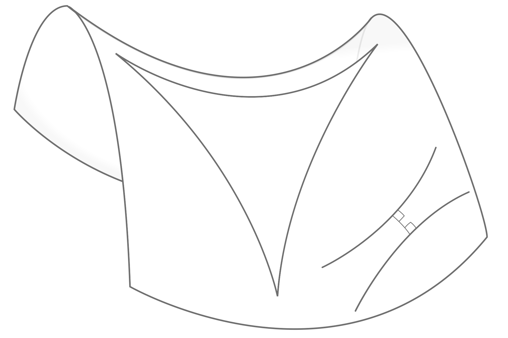
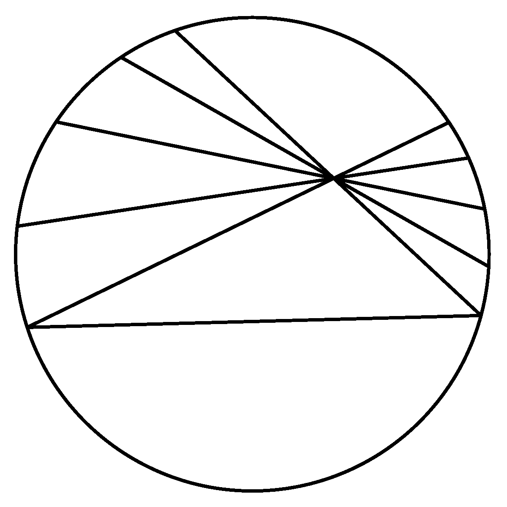
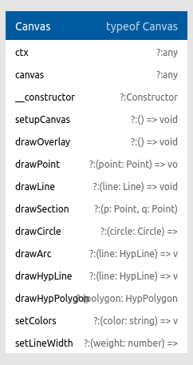
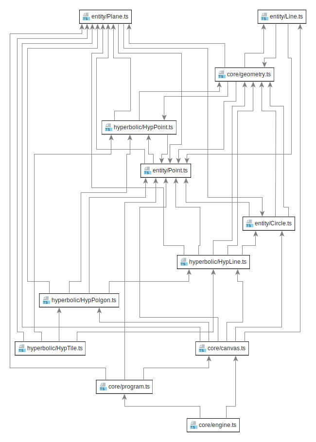

\tableofcontents

\newpage\null\newpage

# Wstęp

## Kontekst historyczny

__Geometria jest nauką o mierze. Nazwa ta narzuca silne skojarzenia z nauką niemalże przyrodniczą. Nauczana we wszystkich szkołach od dwóch i pół tysiaca lat - wydawałoby się jest już czymś bardzo dobrze poznanym. Nowe teorie matematyczne doprowadziły jednak do podważenia tej pewności i powstania geometrii alternatywnych.__

\vspace{3mm}

O życiu Euklidesa wiemy bardzo niewiele, a przecież to jemu zawdzięczamy nazwę _naszej_ geometrii. Ani data urodzenia, ani pochodzenie nie są nam znane, a wszystkie informacje o nim czerpiemy z antycznych dzieł w których opisana jest matematyka. Około 300 roku przed naszą erą, Euklides - dyrektor Biblioteki Aleksandryjskiej, wydał swoje największe dzieło - _Elementy Geometrii_, na które składa się 13 ksiąg zawierających właściwie całą wiedzę matematyczną tamtych czasów. Początkowe definicje pierwszej księgi posiadają 5 stwierdzeń, które wedlug Euklidesa są tak proste, że nie wymagają uzasadnienia. Euklides nazwał je aksjomatami:

> 1. Dowolne dwa punkty można połączyć odcinkiem.
> 2. Dowolny odcinek można przedłużyć nieograniczenie (uzyskując prostą).
> 3. Dla danego odcinka można zaznaczyć okrąg o środku w jednym z jego końcowych punktów i promieniu równym jego długości.
> 4. Wszystkie kąty proste są przystające.
> 5. Dwie proste, które przecinają trzecią w taki sposób, że suma kątów wewnętrznych po jednej stronie jest mniejsza od dwóch kątów prostych, przetną się z tej właśnie strony.

Piąty akjomat mówi o tym, że z jednej strony przecinanej linii dwie proste będą się przybliżać. Zaczał on dość szybko wzbudzać podejrzenia. Jest znacznie bardziej skomplikwany od pozostałych, a już na pewno nie tak intuicyjny. Nawet Euklides unikał używania go w swoim dziele tak długo, jak to było możliwe i użył go dopiero w dowodzie własności 29.

Można śmiało powiedzieć, że piąty aksjomat w kolejnych wiekach spędał uczonym sen z powiek. Przez kolejne 1500 lat matematycy próbowali udowodnić, że o wiele bardziej skomplikowany postulat musi wynikać z pozostałych czterech. Jednym z pierwszych zajmujących się tym problemem uczonych, był żyjący w V wieku naszej ery Proklos. Stwierdził on w swoim komentarzu do dzieł Euklidesa:

> Nie jest możliwe, aby uczony tej miary co Euklides godził się na obecność tak długiego postulatu w aksjomatyce – obecność postulatu wzięła się z pospiesznego kończenia przez niego Elementów, tak aby zdążyć przed nadejściem słusznie oczekiwanej rychłej śmierci; my zatem – czcząc jego pamięć – powinniśmy ten postulat usunąć lub co najmniej znacznie uprościć.

Wyzwanie usunięcia piątego aksjomatu podjęło wielu matematyków w kolejnych wiekach. Prowadziło to do postania wielu nowych twierdzeń, które w istocie były piątemu aksjomatowi równoważne. Prowadziło to do sprzeciwu innych uczonych. W szczególności Immanuel Kant w swoim dziele _Krytyka czystego rozumu_ stwierdził, że intuicja geometryczna jest wrodzona, więc nie może istnieć wiele równoległych geometrii, a każdy kto chciałby zajmować się alternatywnymi geometriami nie nadaje się do nauki. Nie wszyscy zgodzili się z tym stwierdzeniem. Udano się do największego w tamtym czasie autorytetu - Carla Friedricha Gaussa, który jednak wycofał się, bojąc się - jak pisał - wrzasku Boetów. Do problemu należało się jednak odnieść. Odważyło się na to dwóch młodych ludzi, którzy uparli się nie tylko na uprawianie tej geometrii, ale wręcz głosili jej równoprawność. Rosjanin,  Nikołaj Łobaczewski oraz Węgier - Janos Bolyai, niezależnie od siebie opublikowali prace w których - chociaż odmiennie - nowa geometria była konsekwentnie wyprowadzona. Obu odkrywców spotkała też za to kara, Łobaczewski został wręcz zmuszony do opuszczenia katedry.

Sprawę nowej geometrii (nazywanej już geometrią Bolyaia-Łobaczewskiego) przejął Felix Klein. Postawił on tezę, że jeżeli za pomocą geometrii euklidesowej jesteśmy w stanie przedstawić tę nieeuklidesową - i odwrotnie, to oba modele są sobie w istocie równoważne. Opublikował też w 1870 roku dzieło, w którym dowiódł równoprawności obu modeli.

Dosadnie do nowego modelu odniósł się fizyk - Hermann Helmholtz, publikując pracę, w której określił matematykę jako skrzynkę z narzędziami dla nauk przyrodniczych, czym odebrał jej walor nakuki przyrodniczej jako takiej.

## Wybrane zagadnienie

W niniejszej pracy zaimplementowany zostanie prosty silnik graficzny skupiający się na renderowaniu wizualizjacji płaszczyny dysku w modelu Poincarégo geometrii hiperbolitycznej.

Praca swoim zakresem objemie obsługę rysowania lini, okręgów, wielokątów na tejże płaszczyźnie oraz implementacje przykładowych programów objemujących wizualizacje bardziej skomplikowanych struktur. Na tle innych implementacji, aplikacja wyróżnia się dostarczanymi możliwościami i realizacją problemu z pomocą matematycznego opisu pewnego modelu. Przykładowe demonstracje możliwości aplikacji są dostarczone razem z kodem źródłowym, jest to, poza możliwością narysowania dowolnego wielokątu, rysowaniem figur foremnych czy prostych animacji, także interakcja z urządzeniami peryferyjnymi i tesselacja przestrzeni hiperbolicznej. Niewątpliwą zaletą dostarczonej aplikacji jest prostota implementacji własnych rozwiązań, na co składa się silne typowanie języka Typescript wraz z dokładnymi interfejsami dla klas oraz funkcje dostarczone przez silnik, pozwalające na łatwie manipulowanie wyświetlającymi się obiektami, nie wymagające przy tym zrozumienia modelu.

\vspace{3mm}
__Praca składa się z czterech rozdziałów:__

\vspace{3mm}
__Rozdział pierwszy__: W rozdziale omówiono analizę wybranego problemu, przedstawiono motywacje podjęcia tego tematu oraz uzasadniono wybór modelu płaszczyzny Poincarég. Rozdział zawiera poza tym komentarz do różnych rodzajów geometrii nieeuklidesowych, oraz krótki opis i porównanie innych modeli geometrii hiperbolicznej.

\vspace{3mm}
__Rozdział drugi__: Rozdział zawiera szczegółową charakterystykę systemu wraz z opisem poszczególnych plików oraz przeznaczeniem klas i funkcji składających się na program. Opisane w nim zostały algorytmy przekształcające byty w geometrii Euklidesowe na odpowiadające im elementy geometrii hiperbolicznej, funkcje pomocnicze, reprezentacje punktów i linii w obu modelach.

\vspace{3mm}
__Rozdział trzeci__: W rodziale wymieniono technologie użyte do implementacji projektu: wybrany język programowania, środowisko składające się na aplikację oraz biblioteki wykorzystane w programie.

\vspace{3mm}
__Rozdział czwarty__: Rozdział zawiera instrukcje instalacji i wdrożenia systemu w środowisku docelowym. Końcowy rozdział stanowi podsumowanie uzyskanych wyników i ewentualne możliwości rozwoju projektu.

\newpage\null\newpage

# Analiza problemu

__W niniejszym rozdziale przedstawiona będzie analiza problemu, opis matematyczny modelu płaszczyny dysku Poincarégo oraz przegląd kilku wybranych modeli geometrii nieeuklidesowej.__

\vspace{3mm}
Odkrycie, że piątego aksjomatu nie można udowodnić na podstawie pozostałych czterech aksjomatów, było dla naukowców niespodzianką. Zrobiono to, demonstrując istnienie geometrii, w której pierwsze cztery aksjomaty utrzymywały się, ale piąty nie. Debata nad piątym postulatem Euklidesa stworzyła problem, jak alternatywna geometria powinna wyglądać. Umiano pokazać zaledwie poszczególne właściwości takich geometrii. Pierwszy model geometrii nieeuklidesowej został stworzony przez Kleina. W sprawę zaangażowało się wielu matematyków, w tym również Bernard Rieman. Stwierdził on, że można opisać nieskończenie wiele struktur matematycznych, które nie będą spełniały postulatów Euklidesa, będąc dalej geometriami.

## Podstawowy podział

Geometria nieeuklidesowa to każda geometria, która nie spełnia przynajmniej jednego z postulatów Euklidesa. Geometrie nieeuklidesowe możemy podzielić na dwa rodzaje:

{ width=250px }

### Geometria Łobaczewskiego-Bólyaia (hiperboliczna)

  Geometria hiperboliczna jest bliżej związana z geometrią euklidesową, niż się wydaje: jedyną różnicą aksjomatyczną jest postulat równoległy. Po usunięciu postulatu równoległego z geometrii euklidesowej geometria wynikowa jest geometrią absolutną. Wszystkie twierdzenia o geometrii absolutnej, w tym pierwsze 28 twierdzeń zaprezentowanych przez Euklisdesa, obowiązują w geometrii i euklidesowej i hiperbolicznej.

  W modelu hiperbolicznym, w płaszczyźnie dwuwymiarowej, dla dowolnej linii $L$ i punktu $X$, który nie jest na $L$, istnieje nieskończenie wiele linii przechodzących przez $X$, które się nie przecinają $L$.

### Geometria Riemanna (eliptyczna)

  Geometria eliptyczna jest geometrią nieeuklidesową o dodatniej krzywiźnie, która zastępuje postulat równoległy stwierdzeniem "przez dowolny punkt na płaszczyźnie, nie ma linii równoległych do danej linii". Geometria liptyczna jest czasem nazywana również geometrią Riemannowską. Model można zwizualizować jako powierzchnię kuli, na której linie przyjmowane są jako wielkie koła. W geometrii eliptycznej suma kątów trójkąta wynosi >180 stopni.
  
  W modelu eliptycznym dla dowolnej linii $L$ i punktu $X$, który nie jest na $L$, wszystkie linie przechodzące przez $X$ przecinają się $L$.

### Różnice pomiędzy geometriami

Sposobem opisania różnic między tymi geometriami jest rozważenie dwóch linii prostych rozciągniętych w nieskończoność w płaszczyźnie dwuwymiarowej, które są prostopadłe do trzeciej linii:

- W geometrii euklidesowej linie pozostają w stałej odległości od siebie (co oznacza, że linia narysowana prostopadle do jednej linii w dowolnym punkcie przecina drugą linię, a długość odcinka linii łączącego punkty przecięcia pozostaje stała) i są znane jako równoległe.
- W geometrii hiperbolicznej linie _zakrzywiają się_ od siebie, zwiększając odległość w miarę przesuwania się dalej od punktów przecięcia ze wspólną prostopadłą; linie te są często nazywane ultraparallelami .
- W geometrii eliptycznej linie _zakrzywiają się_ do siebie i w końcu przecinają.


Ta praca skupia się na geometrii hiperbolicznej. Istnieje kilka możliwych sposobów wykorzystania części przestrzeni euklidesowej jako modelu płaszczyzny hiperbolicznej. Wszystkie te modele spełniają ten sam zestaw aksjomatów i wyrażają tę samą abstrakcyjną płaszczyznę hiperboliczną. Dlatego wybór modelu nie ma znaczenia dla twierdzeń czysto hiperbolicznych, jednak robi to różnicę podczas wizualizacji geometrii hiperbolicznej. Następne podrozdziały są poświęcone krótkiemu omówieniu najpopularniejszych z nich.

## Popularne modele geometrii hiperbolicznej

Geometria hiperboliczna została opisana za pomocą wielu modeli. Najpopularniejsze przedstawiono poniżej.

### Model Kleina

Model Kleina - a w zaszadzie model dysku Beltrami–Kleina jest modelem geometrii hiperbolicznej, w którym punkty są reprezentowane przez punkty we wnętrzu dysku. Przyjmuje on następujące zalożenia:

{ width=250px }

- __Płaszczyną hiperboliczną__ jest wnętrze koła bez krawędzi.
- __Prostymi hiperbolicznymi__ są cięciwy tego koła (końce prostej).
- __Proste będą prostopadłe__ wtedy, gdy przedłużenie jednej z nich przechodzi przez punkt przecięcia stycznych do obu linii.

{ width=250px }

Linie w modelu pozostają proste, a cały model można łatwo osadzić w ramach rzeczywistej geometrii rzutowej. Model ten nie jest jednak zgodny, co oznacza, że kąty są zniekształcone, a okręgi na płaszczyźnie hiperbolicznej na ogół nie są okrągłe w modelu.

### Model półpłaszczyzny Poincaré

Model półpłaszczysny Poincaré to płaszczyzna:
$$ {\{(x, y) \mid y > 0; x, y \in \mathbb {R} \}} $$
Jest to model dwuwymiarowej geometrii hiperbolicznej.

{ width=250px }

Model nosi imię Henri Poincaré, ale został stworzony przez Eugenio Beltramiego, który użył go wraz z modelem Kleina i modelem dysku Poincaré, aby pokazać, że geometria hiperboliczna jest równie spójna, jak spójna jest geometria euklidesowa. Ten model jest zgodny, co oznacza, że kąty zmierzone w punkcie modelu są równe kątom na płaszczyźnie hiperbolicznej.

### Model dysku Poincaré

Model dysku Poincaré wykorzystuje wnętrze dysku jako model płaszczyzny hiperbolicznej. Najbardziej oczywistym wyborem dla dysku jest dysk jednostkowy, który będzie również przedmiotem dalszych rozważań.

- __Punkty hiperboliczne__ to punkty wewnątrz dysku jednostkowego.
- __Linie hiperboliczne__ to łuki koła prostopadłe do dysku. Linie hiperboliczne przechodzące przez początek degenerują się do średnic, o których można pomyśleć jako łuki kół o nieskończonym promieniu.
- __Kąty__ są mierzone jako kąt euklidesowy między stycznymi w punkcie przecięcia.
- __Odległości__ między punktami hiperbolicznymi można mierzyć w oparciu o normę euklidesową:

$$ {\displaystyle \delta (u,v)=2{\frac {\lVert u-v\rVert ^{2}}{(1-\lVert u\rVert ^{2})(1-\lVert v\rVert ^{2})}}} $$

{ width=250px }

Ponieważ rozpatrywany jest dysk jednostkowy, formuła nie zawiera w zmiennej dla promienia.

{ width=250px }

Model jest zgodny, to znaczy, że zachowuje kąty. Oznacza to, że kąty hiperboliczne między krzywymi są równe kątom euklidesowym w punkcie przecięcia. Wadą jest fakt, że ponieważ linia hiperboliczna jest modelowana przez łuk koła euklidesowego, linie proste wydają się zakrzywione.

### Model Hemisfery

Hemisfera nie jest często używana jako model płaszczyzny hiperbolicznej jako taka. Jest to jednak bardzo przydatna w łączeniu różnych innych modeli za pomocą różnych rzutów, jak pokazano na poniższym rysunki.

- __Punkty hiperboliczne__ to punkty na półkuli południowej.
- __Linie hiperboliczne__ to półkola powstałe z przecięcia półkuli południowej z płaszczyznami prostopadłymi do równika.

{ width=500px }

Wadą tego rozwiązania, jest dodatkowy wymiar, jaki należy rozpatrywać przy pracy z tym modelem.

## Uzasadnienie wyboru modelu dysku Poincaré

Jak stwierdzono na początku tego rozdziału, kolejne rozdziały, a także opisane implementacje będą prawie wyłącznie korzystać z modelu dysku Poincaré. Podczas renderowania geometrii hiperbolicznej wydaje się to być właściwym wyborem, z uwagi na wartości estetyczne i zgodność modelu.


\newpage\null\newpage

# Projekt systemu

__W niniejszym rozdziale przedstawiony zostanie szczegółowy projekt systemu, jego matematyczną interpretacje, zależności pomiędzy klasami oraz podstawowe algorytmy składające się na logikę funkcjonowania silnika.__

## Cykl pracy silnika

Głównym plikiem silnika jest `main.ts` znajdujący się w katalogu `/src`. Po załadowaniu programu, tworzy on instancje klasy `Canvas` odpowiedzialnej za rysowanie elementów na ekranie, ładuje konfiguracje wyświetlanego programu i tworzy pętlę silnika poprzez wywołanie metody `createLoop()` klasy `Engine`.



Moduł odpowiedzialny za renderowanie obrazu znajduje się w pliku `canvas.ts`. Konstruktor klasy `Canvas` przyjmuje elemtent `canvas` ze strony oraz jego kontekst, oraz inicjuje się poprzez wywołanie funkcji `setupCanvas()`, która ustala szerokość i wysokość elementu. W każdym cyklu silnika, wywoływana jest funkcja `drawOverlay()`, która resetuje element do podstawowego widoku. Kolejne funkcje klasy odpowiadają za rysowanie punktów, liń, łuków i wielokątów. Poza tym klasa udostępnia też funcje zmiany koloru rysowanych elementów i grubości linii.


Klasa `Engine` przyjmuje konfigurację z pliku `/assets/config.json`, która ustala ilość FPS, wywołuje następnie metodę `drawOverlay()` klasy `Canvas` i odpala funkcję `onLoop()` z programu, konfigurację którego dostaje za pomocą _dependency injection_ w parametrach konstruktora.


Odtwarzany program tworzony jest poprzez wywołanie instancji klasy programu, dziedziczącej po abstrakcyjnej klasie `Program`, udostępniającej metody takie jak `onLoop()`.

## Klasy obiektów

Każdy możliwy do narysowania obiekt jest instancją jednej z klas. W kodzie silnika istnieje wyraźny podział na klasy udostępniające obiekty rysowane w przestrzeni euklidesowej i hiperbolicznej. Wszystkie byty znajdują się w katalogu `/src/core/entity`. Kolejne rodziały są poświęcone opisie i interpretacji poszczególnych klas.



### Klasa Line


Konstruktor klasy `Line` przyjmuje dwie zmienne typu `number`. Programista może skorzystać z metody `at(x: number): number`, która zwraca wartość w punkcie `x` oraz `intersectPoint(line: Line): Point`, która zwraca punkt przecięcia tejże linii z inną linią. Alternatywnymi sposobami na stworzenie instancji klasy `Line` jest skorzystanie ze statycznych metody `fromPoints(p: Point, q: Point)`, która tworzy linię z dwóch punktów lub `fromPointSlope(p: Point, q: number)`, która do stworzenia linii potrzebuje podania punktu i kąta wyrażonego w radianach.

### Klasa Point


Konstruktor klasy `Point` przyjmuje dwie zmienne typu `number`, które są reprezentacją bezwzględnych koordynatów puntu na płótnie. Programista może skorzystać z metody `toHypPoint(plane: Plane): HypPoint`, która przyjmuje instancję klasy `Plane` i zwraca dla niej koordynaty punktu w interfejsie `HypPoint`, oraz z metody `inversion(plane: Plane)`, zwracającej punkt odbity względem centralnego punktu obiektu klasy `Plane`.

### Klasa Circle


Konstruktor klasy `Circle` przyjmuje punkt centralny będący instancją klasy `Point` i średnicę typu `number`, oraz udostępnia metodę `intersectPoints(circle: Circle): [Point, Point]`, przyjmującą drugi okrąg i zwracającą parę punktów, w których przecinają się oba obiekty. Funkcja `fromPoints(p: Point, q: Point, r: Point)` umożliwia alternatywny sposób stworzenia okręgu z trzech obiektów klasy `Point`.

### Klasa Plane

Najważniejszym z pośród omawianych dotycznas bytów jest instancja klasy `Plane`, będąca singletonem i punktem odniesienia do wszystkich obiektów dla geometrii hiperbolicznej. Klasa `Plane` dziedziczy po klasie `Circle`, podobnie jak ona posiada centrum i średnicę, liczone automatycznie na podstawie szerokości i wysokości ekranu przy pobraniu instancji klasy.

\newpage\null\newpage

# Implementacja systemu

__W niniejszym rozdziale omówiona zostanie technologia, konfiguracja oraz wdrożenie systemu wraz z krótkim opisem poszczególnych części systemu i kodu źródłowego.__

## Opis technologii

Do implementacji systemu użyto języka `TypeScript` w wersji `3.6.3`, bundlera (transpilatora nowoczesnych wersji języka `JavaScript` do wersji zrozumiałych dla przeglądarek) `webpack` w wersji `2.3.3` oraz `CSS3` i  `HTML5` wraz z elementem `<canvas>` odpowiedzialnym za rysowanie grafiki na ekranie. Pełna lista wszystkich bibliotek wraz z ich wersjcami znajduje się w pliku `package.json`, w katalogu głównym projektu.

# Instalacja i wdrożenie

__Rozdział ten zawiera informacje o sposobie zbudowania aplikacji w celu jej uruchomienia i opcjonalnie - wdrożenia na serwerze WWW.__

Do zbudowania aplikacji konieczny będzie menager pakietów `npm` w wersji przynajmniej `6.5.0` oraz środowisko uruchomieniowe języka `JavaScript` - `node.js` w wersji  `10.6.0` lub nowszej. Instalacja wymaganych pakietów odbywa się poprzez wpisanie w konsoli polecenia

``` BASH
npm install
```

w katalogu głównym projektu. Następnie należy zbudować aplikację poleceniem

``` BASH
npm run build
```

Po zbudowaniu aplikacji, w katalogu głównym pojawi się folder `dist` z plikami, które wraz z plikem `index.html` składają się na gotowy program możliwy do uruchomiania w przeglądarce.

## Serwer deweloperski

Aplikacja wspiera tryb deweloperski, w którym bieżące zmiany w kodzie automatycznie są budowane do plików wynikowych. Do uruchomienia trybu deweloperskiego potrzebne są te same pakiety instalowane poleceniem:

``` BASH
npm install
```

Wywołanie trybu odbywa się komendą:

``` BASH
npm run build-watch
```

\newpage\null\newpage

# Podsumowanie

\newpage\null\newpage

# Bibliografia

- Martin Freiherr von Gagern, Creation of Hyperbolic Ornaments Algorithmic and Interactive Methods, Technischen Universitat Munchen
- Tam, gdzie proste są krzywe, Geometrnie enieuklidesowe, Joan Gómez, RBA, 2010
- Bjørn Jahren, An introduction to hyperbolic geometry, MAT4510/3510
- Izabela Przezdzink, Geometria Poincarégo i Kleina. Skrypt do zajęć: Podstawy geometrii i elementy geometrii nieeuklidesowej, Wrocław 2010, Uniwersytet Wrocławski Wydział Matematyki i Informatyki Instytut Matematyczny
- Mateusz Kłeczek, Geometria hiperboliczna, Chrzanów 2016
- Caroline Series With assistance from Sara Maloni, Hyperbolic geometry MA448
- Steve Szydlik, Hyperbolic Constructions in Geometer’s Sketchpad, December 21, 2001
- Marek Kordos, Geometria Bolyaia–Łobaczewskiego, http://www.deltami.edu.pl, Sierpień 2018

\newpage\null\newpage

# Zawartość płyty CD